<div align="center">

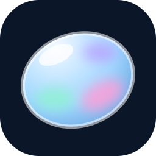

# Opal

**Wer zuerst richtig liegt, holt den Punkt.**

Fun-Fact-Quizduelle in Echtzeit im Browser: Ranked mit Elo, Unranked, private Lobbys per Code
und Training allein oder gegen Bots. Die Fragen stellst du dir aus Paketen zusammen, von
Allgemeinwissen über Anime bis Parfüm. Oberfläche in echtem Liquid Glass mit Lichtbrechung.

[](https://imkirit.dev/opal)
[](packs/)
[](https://nodejs.org/)

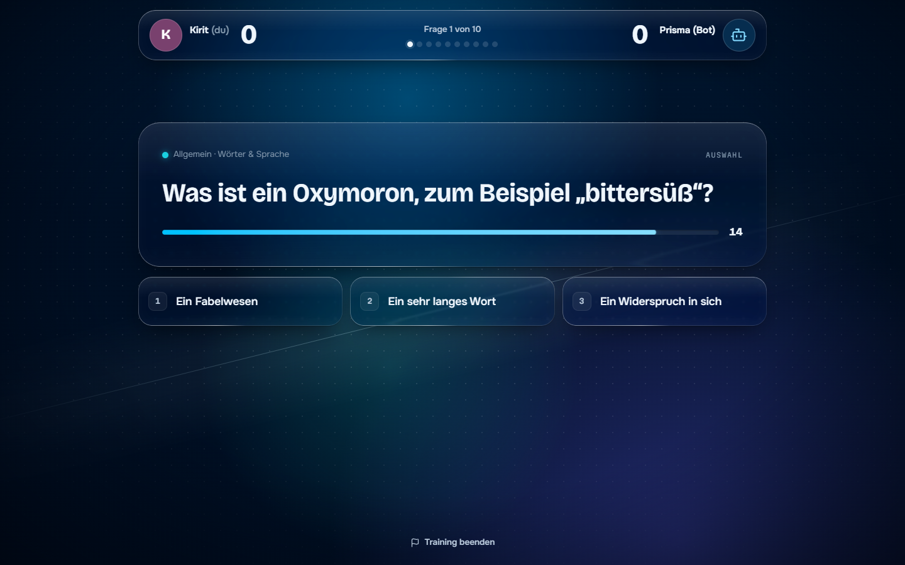

</div>

---

## Why?

Die meisten Quiz-Apps sind entweder Rätsel für dich allein oder Runden, bei denen jemand
vorne moderiert. Opal ist ein Rennen: alle sehen dieselbe Frage, und nur wer zuerst richtig
antwortet, bekommt den Punkt. Gefragt werden Dinge, die man gern weiß, etwa wie die Angst
vor langen Wörtern heißt oder welches Tier würfelförmigen Kot hinterlässt.

Themen sind **Pakete statt fester Kategorien**. Du nimmst ein ganzes Paket oder nur die
Bereiche, die du wirklich kennst, zum Beispiel bei Anime nur One Piece und Naruto. Im
Unranked spielst du die Schnittmenge mit deinem Gegner, im Ranked alle dasselbe
Allgemein-Paket, damit nicht die zufällige Nische entscheidet.

## Getting started

1. **Starte Opal und melde dich an.** Mit Discord oder als Gast mit einem Namen. Gäste
   können alles außer Ranked. Die Beispielfrage rechts lässt sich sofort ausprobieren.

   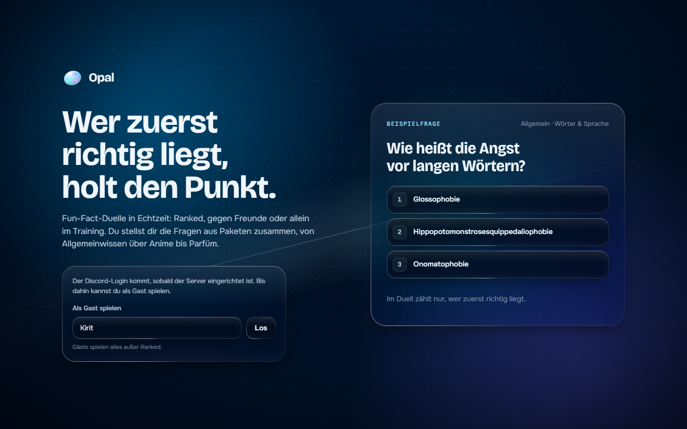

2. **Wähl deine Pakete.** Oben auf `Pakete`: ein Klick auf den Kopf einer Karte schaltet das
   ganze Paket, die Chips darunter einzelne Bereiche. Oben rechts steht, wie viele Fragen aktiv sind.

   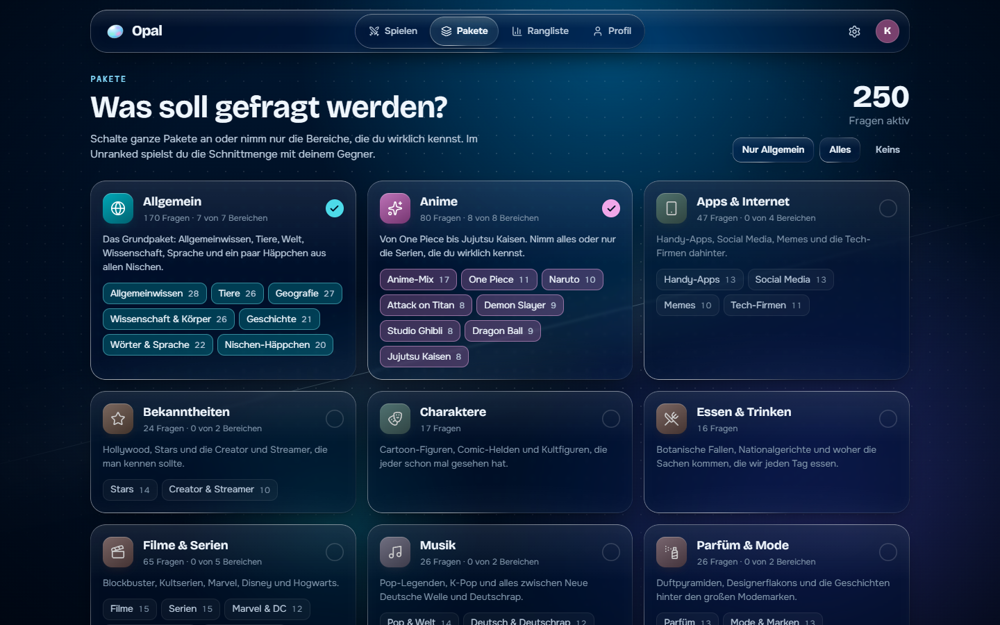

3. **Such dir einen Modus aus.** Unter `Spielen` stehen Ranked, Unranked, Private Lobby und
   Training. Rechts unter `Deine Runde` legst du fest, ob du aus drei Antworten wählst, selbst
   tippst oder beides gemischt. Für den Anfang: Training, `Gegen Bot`, `Mittel`.

   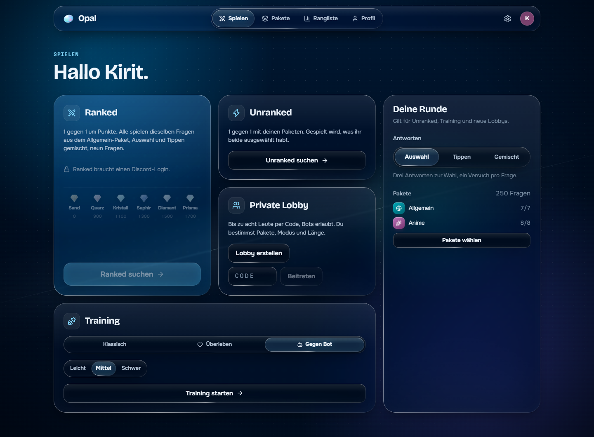

4. **Sei schneller als dein Gegner.** Klick die Antwort oder drück `1`, `2` oder `3`. Wer zuerst
   richtig liegt, holt den Punkt, danach gibt es die Auflösung mit einem Fun Fact.

   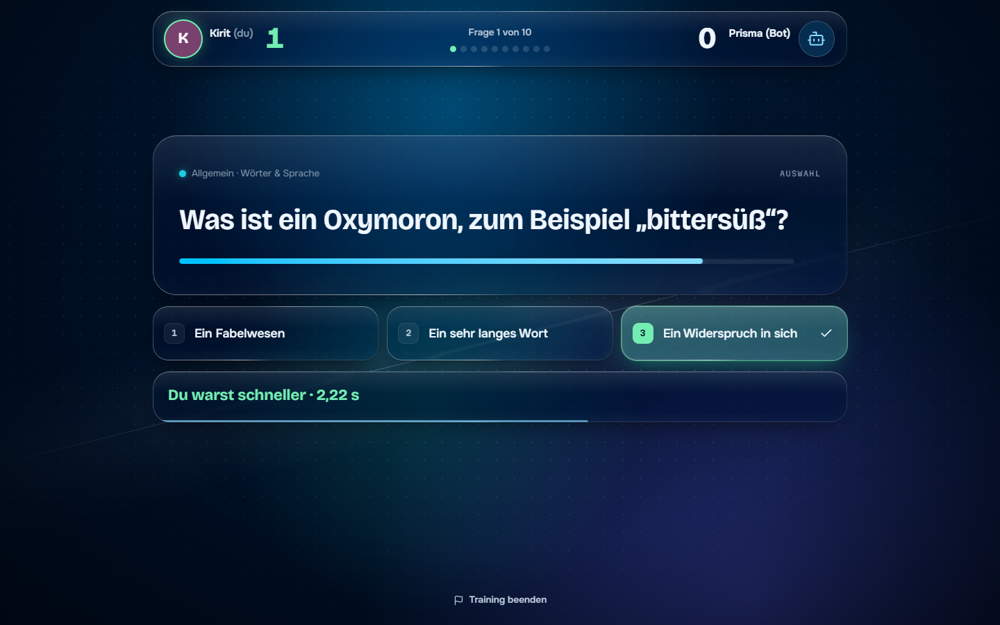

5. **Optional:** Lobby erstellen und den fünfstelligen Code an Freunde schicken, oder mit
   Discord-Login ins Ranked.

## Features

### Spielen

- **Wer zuerst richtig liegt.** Die Reaktionszeit misst der Server, nicht der Browser. Bei
  Auswahlfragen hast du einen Versuch, beim Tippen beliebig viele.
- **Tippen mit Nachsicht.** Groß/Klein, Umlaute (`ü`, `ue`, `u`), Akzente, Artikel und kleine
  Tippfehler werden verziehen, Zahlen müssen exakt stimmen.
- **Ranked mit Elo.** 1 gegen 1, neun Fragen, Start bei 1000 Punkten, Rangstufen von Sand über
  Quarz, Kristall, Saphir und Diamant bis Prisma. Die ersten fünf Spiele sind die Einstufung.
- **Unranked.** 1 gegen 1 mit deinen Paketen, gespielt wird, was ihr beide ausgewählt habt.
  Dauert die Suche, kannst du nach ein paar Sekunden stattdessen gegen einen Bot spielen.
- **Private Lobbys.** Bis zu acht Teilnehmer per Code, Bots in drei Stärken, der Host wählt
  Pakete, Antwortmodus und 5 bis 20 Fragen. Nach dem Spiel bleibt die Lobby offen.
- **Training.** Klassisch mit 10, 20 oder 30 Fragen, Überleben mit drei Leben, oder gegen
  Kiesel, Prisma oder Obsidian (Bots leicht, mittel, schwer).
- **Gleichstand.** Bis zu drei Entscheidungsfragen, danach unentschieden.

### Fragen

- **11 Pakete, 571 Fragen.** Allgemein (mit Tieren, Geografie, Wissenschaft, Geschichte,
  Wörtern und Nischen-Häppchen), Anime, Videospiele, Filme & Serien, Apps & Internet, Musik,
  Parfüm & Mode, Bekanntheiten, Sport, Essen & Trinken, Charaktere.
- **Bereiche einzeln wählbar.** Anime hat zum Beispiel One Piece, Naruto, Attack on Titan,
  Demon Slayer, Studio Ghibli, Dragon Ball und Jujutsu Kaisen als eigene Bereiche.
- **Wenig Wiederholungen.** Deine zuletzt gesehenen 250 Fragen kommen erst wieder dran, wenn
  sonst zu wenig übrig ist.
- **Eigene Fragen.** Pakete sind JSON-Dateien in `packs/`, `npm run check:packs` prüft sie.

### Aussehen und mehr

- **Echtes Liquid Glass.** Glasflächen brechen den Hintergrund an der gewölbten Kante nach dem
  Brechungsgesetz, mit leichter Prisma-Farbaufspaltung. In Chrome, Edge und der Desktop-App voll,
  in Firefox und Safari automatisch als schlichtes Glas.
- **Farbthemen.** Tiefsee (Standard), Mitternacht, Lagune, Amethyst, Rosé, Glut, Graphit oder
  eigene Farbtöne für Hintergrund und Akzent.
- **Profil und Rangliste.** Duelle, Siege, Trefferquote, Antwortzeit, beste Serie,
  Überleben-Rekord und die letzten Spiele.
- **Handy-tauglich.** Unter 880 px wandert die Navigation als Tab-Leiste nach unten.
- **Wiedereinstieg.** Nach Reload oder Verbindungsabbruch geht das Spiel weiter, 20 Sekunden hat man Zeit.

## Screens

| | |
|---|---|
| **Ergebnis** mit Statistik und Platzierung | **Tippen** mit durchgestrichenen Fehlversuchen |
| 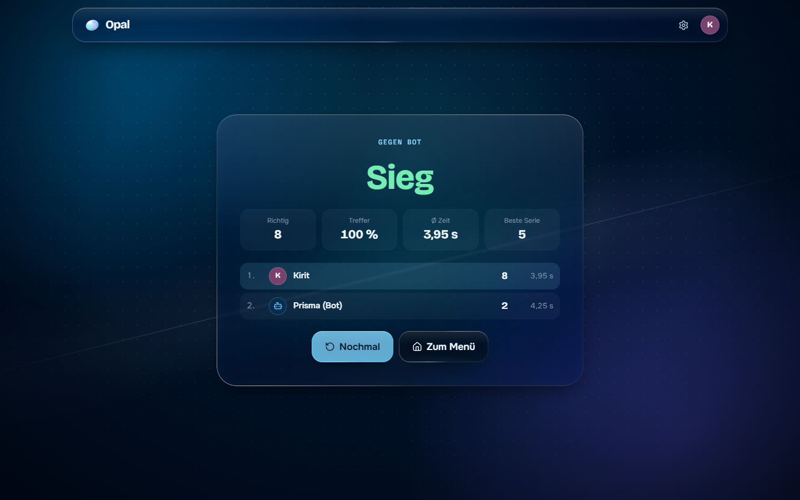 | 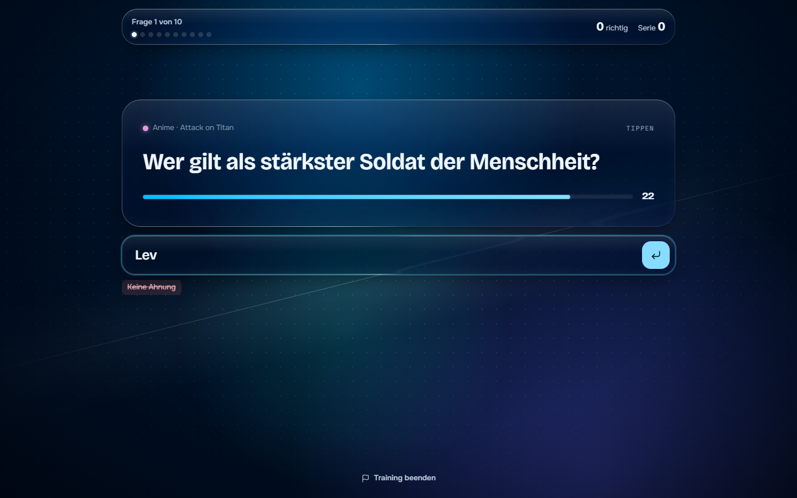 |
| **Private Lobby** mit Code und Bots | **Einstellungen** mit Farbthemen und Glasqualität |
| 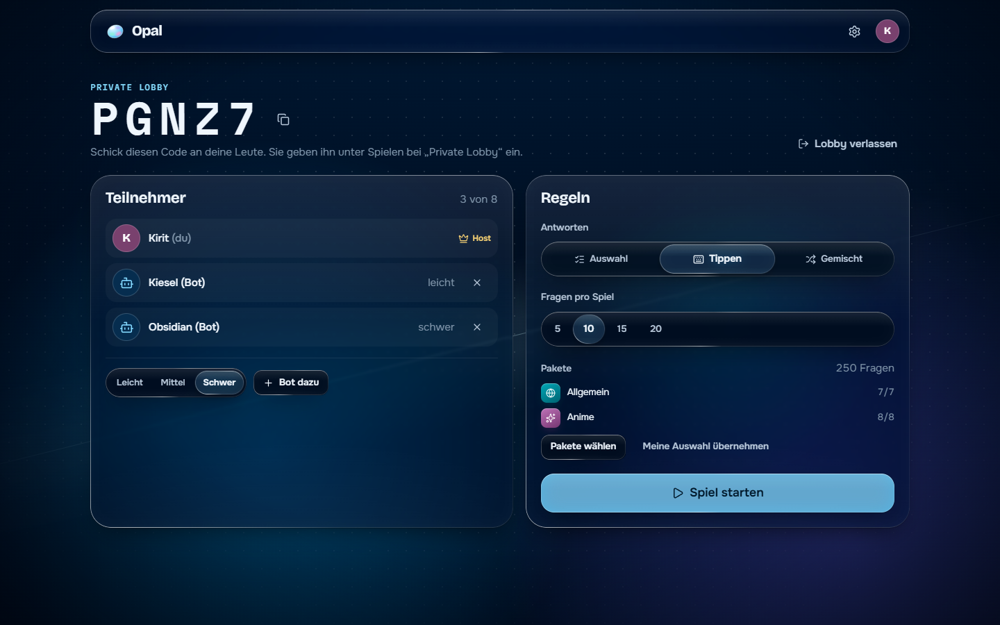 | 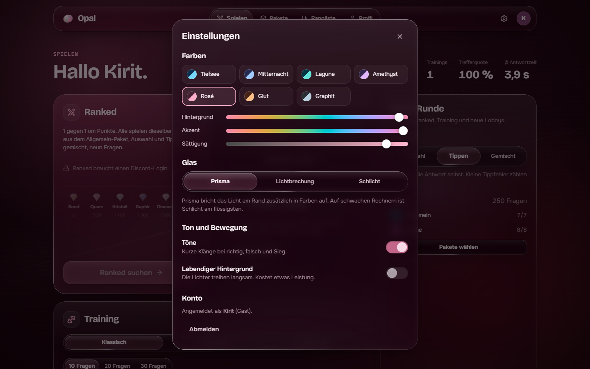 |
| **Thema Rosé** statt Tiefsee | **Am Handy** |
| 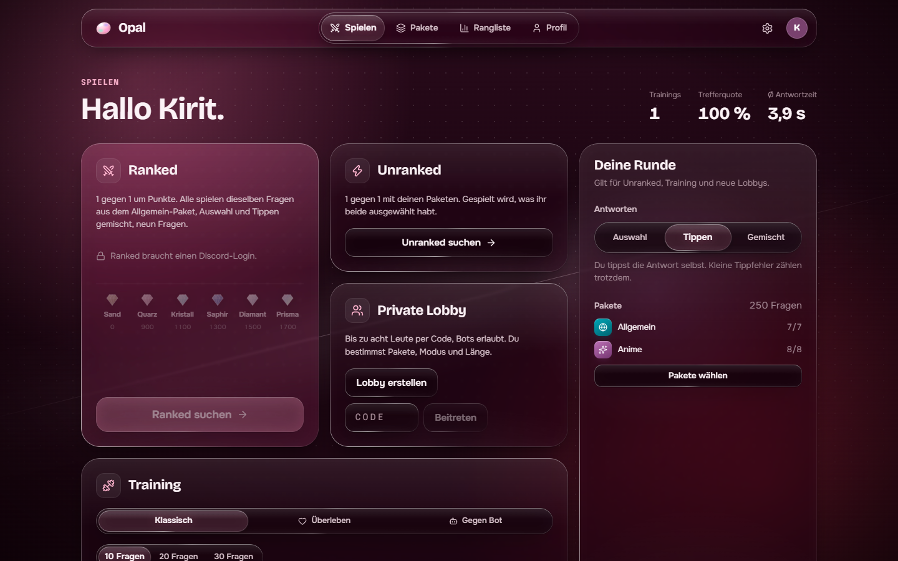 | 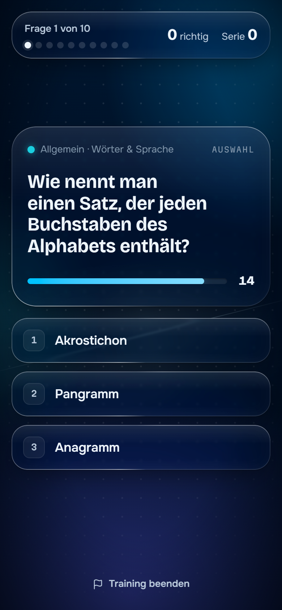 |

## Tasten

| Taste | Wirkung |
|---|---|
| `1` `2` `3` | Antwort wählen (Auswahlfragen) |
| `Enter` | getippte Antwort abschicken |
| `Esc` | Dialog schließen |

## Discord-Login einrichten

Ohne Zugangsdaten läuft Opal nur mit Gast-Login, die Startseite sagt das auch. So schaltest du
Discord frei:

1. Auf [discord.com/developers/applications](https://discord.com/developers/applications) eine
   Anwendung anlegen.
2. Unter **OAuth2 → Redirects** die Adresse eintragen, **exakt** so, wie Spieler die Seite öffnen:
   lokal `http://localhost:5174/auth/discord/callback` (der Vite-Port, nicht 3130),
   live zum Beispiel `https://imkirit.dev/opal/auth/discord/callback`.
3. Client-ID und Client-Secret in `server/.env` eintragen und den Server neu starten.

Opal fragt nur den Scope `identify` ab (Name, Avatar, ID), keine E-Mail und keine Server.
Wer als Gast gespielt hat und dann Discord verbindet, behält seine Statistiken.

## Konfiguration

`server/.env`, Vorlage in `server/.env.example`:

| Variable | Standard | Was es tut |
|---|---|---|
| `PORT` | `3130` | Port des Servers |
| `HOST` | alle Adressen | live `127.0.0.1`, wenn ein Proxy wie nginx davor steht |
| `PUBLIC_URL` | `http://localhost:<PORT>` | Adresse, unter der Spieler die Seite öffnen. `https` schaltet sichere Cookies ein, ein Pfad wie `/opal` wird zum Präfix für alle Routen |
| `BASE_PATH` | Pfad aus `PUBLIC_URL` | Präfix ausdrücklich setzen, zum Beispiel `/opal` |
| `DISCORD_CLIENT_ID` | leer | leer = Discord-Login aus |
| `DISCORD_CLIENT_SECRET` | leer | nur auf dem Server, nie im Client |
| `DISCORD_REDIRECT_URI` | `${PUBLIC_URL}/auth/discord/callback` | muss im Discord-Portal stehen |
| `ALLOW_GUESTS` | `true` | `false` erlaubt nur Discord |
| `RANKED_SECTIONS` | alle Bereiche von `allgemein` | Ranked-Pool als Komma-Liste `paket/bereich` |
| `DATA_DIR` | `server/data` | Ort der Datenbank |
| `PACKS_DIR` | `packs` | Ort der Fragenpakete |

## How data is stored

```
server/data/
└─ opal.db           SQLite: Spieler, Sessions, beendete Spiele, Elo
packs/
└─ *.json             Fragenpakete, werden beim Serverstart geladen
Browser
└─ localStorage       opal.prefs: Farbthema, Glasqualität, Töne, deine Paketauswahl
```

Im Browser liegt nur ein Session-Cookie (`opal_sid`, httpOnly). Die Antworten der Fragen
verlassen den Server erst mit der Auflösung.

## Install

**Spielen: [imkirit.dev/opal](https://imkirit.dev/opal)**, nichts zu installieren.

Selbst betreiben, aus dem Quellcode:

```
npm install
npm run build
npm start             # http://localhost:3130
```

Node 22.13 oder neuer ist nötig (wegen des eingebauten `node:sqlite`). Soll Opal in einem
Unterordner laufen wie auf imkirit.dev, dann `PUBLIC_URL=https://deine-domain/opal` setzen und
mit `npm run build:live` bauen, der Client kennt dann den Präfix `/opal/`. Vor den Server
gehört ein Proxy wie nginx, der den Pfad unverändert durchreicht und WebSockets weiterleitet.

**Desktop-App:** `desktop/` enthält eine Electron-Hülle, die Opal in einem eigenen Fenster
öffnet (`desktop/opal.config.json` zeigt auf `https://imkirit.dev/opal/`). `npm install` und
`npm run dev` im Ordner `desktop/` starten sie, `npm run dist` baut einen Windows-Installer.

## Development

```
npm install             # Client und Server (npm-Workspaces)
npm run dev             # Server auf 3130 und Vite auf 5174, http://localhost:5174
npm run build           # Client nach client/dist, der Server liefert ihn dann selbst aus
npm run build:live      # dasselbe für den Unterordner /opal/ (so läuft es auf imkirit.dev)
npm start               # nur der Server
npm run typecheck       # TypeScript im Client
npm run check:packs     # Fragenpakete prüfen: Form, Dubletten, Gedankenstriche
npm test -w server      # Tests der Tipp-Erkennung
node Claude/scripts/readme-shots.mjs   # README-Bilder neu erzeugen (Server und Client müssen laufen)
```

`server/` ist Node mit Express 5 und Socket.IO. Eine einzige Spiel-Engine (`game/match.js`)
trägt alle Modi, Matchmaking, Lobbys, Bots und Elo liegen daneben in `game/`. `client/` ist
React 19 mit Vite und TypeScript, die Glas-Engine steckt in `client/src/glass/`. Die Fragen
sind reine JSON-Dateien in `packs/`.

## License

Noch keine Lizenz festgelegt, alle Rechte beim Autor. Die Schriften Bricolage Grotesque, Onest
und Martian Mono stehen unter der SIL Open Font License, siehe `client/src/assets/fonts/`.
