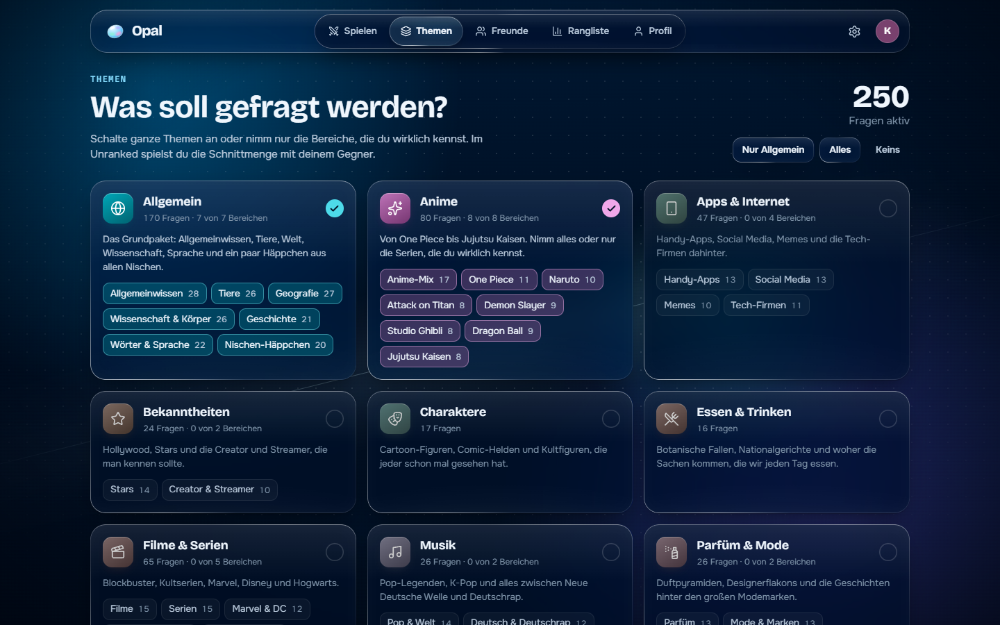
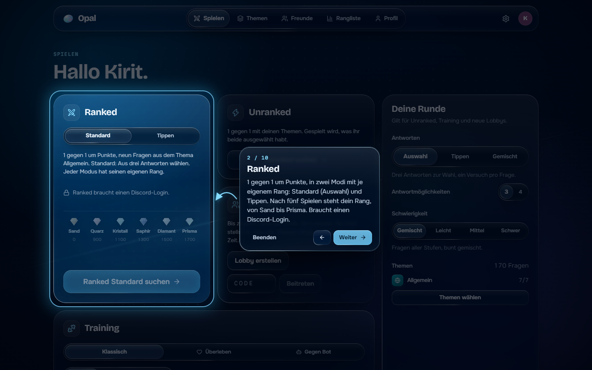
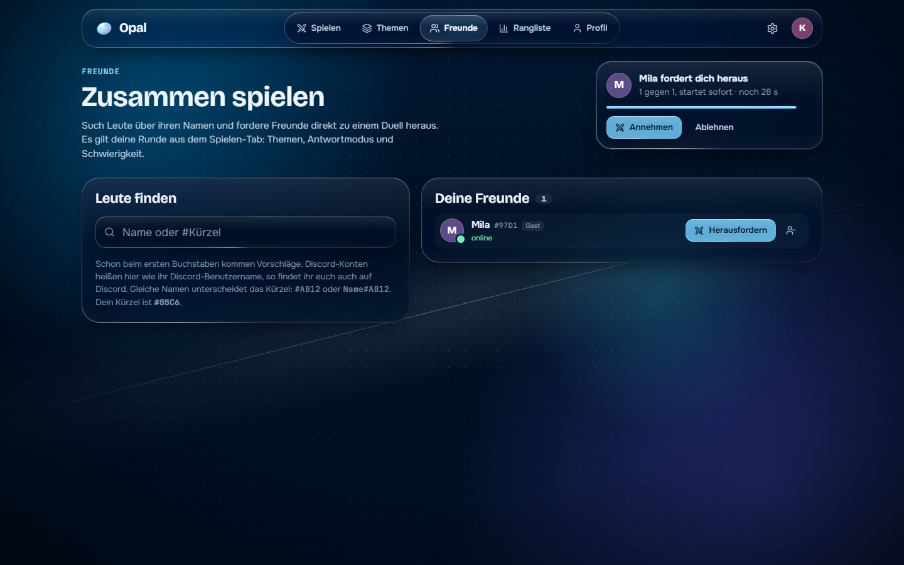

<div align="center">


# Opal

**Wer zuerst richtig liegt, holt den Punkt.**

Fun-Fact-Quizduelle in Echtzeit im Browser: Ranked mit Elo in zwei Modi, Unranked, private Lobbys
per Code, Duelle gegen Freunde und Training allein oder gegen Bots. Die Fragen stellst du dir aus Themen
zusammen, von Allgemeinwissen über Anime bis Parfüm. Oberfläche in echtem Liquid Glass mit
Lichtbrechung.

[](https://imkirit.dev/opal)
[](packs/)
[](https://nodejs.org/)


</div>

---

## Why?

Die meisten Quiz-Apps sind entweder Rätsel für dich allein oder Runden, bei denen jemand
vorne moderiert. Opal ist ein Rennen: alle sehen dieselbe Frage, und nur wer zuerst richtig
antwortet, bekommt den Punkt. Gefragt werden Dinge, die man gern weiß, etwa wie die Angst
vor langen Wörtern heißt oder welches Tier würfelförmigen Kot hinterlässt.

Die Fragen kommen aus **Themen statt fester Kategorien**. Du nimmst ein ganzes Thema oder nur
die Bereiche, die du wirklich kennst, zum Beispiel bei Anime nur One Piece und Naruto. Im
Unranked spielst du die Schnittmenge mit deinem Gegner, im Ranked alle dasselbe Thema
Allgemein, damit nicht die zufällige Nische entscheidet. Ranked gibt es als **Standard** (aus drei
Antworten wählen) und **Tippen**, jeweils mit eigenem Rang und eigener Rangliste.

## Getting started

1. **Starte Opal und melde dich an.** Mit Discord oder als Gast mit einem Namen. Gäste
   können alles außer Ranked. Die Beispielfrage rechts lässt sich sofort ausprobieren. Beim
   ersten Besuch zeigt ein kurzer Rundgang mit Pfeilen, wo alles ist.

   

2. **Wähl deine Themen.** Oben auf `Themen`: ein Klick auf den Kopf einer Karte schaltet das
   ganze Thema, die Chips darunter einzelne Bereiche. Oben rechts steht, wie viele Fragen aktiv sind.

   

3. **Such dir einen Modus aus.** Unter `Spielen` stehen Ranked, Unranked, Private Lobby und
   Training. Rechts unter `Deine Runde` legst du fest, ob du aus drei oder vier Antworten
   wählst, selbst tippst oder beides gemischt, und wie schwer die Fragen sein sollen. Für den
   Anfang: Training, `Gegen Bot`, `Mittel`.

   

4. **Sei schneller als dein Gegner.** Klick die Antwort oder drück `1` bis `4`. Wer zuerst
   richtig liegt, holt den Punkt. Danach kommt unten die Auflösung, grün oder rot, und mit
   `Weiter` (oder `Enter`) geht es zur nächsten Frage, wenn du so weit bist.

   

5. **Mit Freunden spielen:** unter `Freunde` Leute suchen, Vorschläge kommen ab dem ersten
   Buchstaben. Anfrage schicken (auch direkt aus der Rangliste oder nach einem Spiel) und
   Freunde danach direkt herausfordern. Oder eine Lobby
   erstellen und den fünfstelligen Code schicken. Mit Discord-Login geht es ins Ranked.

## Features

### Spielen

- **Wer zuerst richtig liegt.** Die Reaktionszeit misst der Server, nicht der Browser. Bei
  Auswahlfragen hast du einen Versuch, beim Tippen beliebig viele, aber jeder falsche kostet
  3 Sekunden deiner Zeit.
- **Überspringen.** Weißt du es nicht, lässt du die Frage aus. Sind alle durch, geht es sofort
  weiter, Bots antworten dann direkt.
- **Weiter-Knopf wie bei Duolingo.** Nach jeder Frage bleibt die Auflösung stehen, bis du auf
  `Weiter` drückst. Zu zweit oder mehr: hat die erste Person gedrückt, haben die anderen noch
  10 Sekunden.
- **Schwierigkeit und Antworten.** Gemischt, leicht, mittel oder schwer, dazu drei oder vier
  Antwortmöglichkeiten. Beim Tippen kommen allgemein leichtere Fragen. Die richtige Antwort
  steht jedes Mal auf einem zufälligen Platz.
- **Tippen mit Nachsicht.** Groß/Klein, Umlaute (`ü`, `ue`, `u`), Akzente, Artikel und kleine
  Tippfehler werden verziehen, Zahlen müssen exakt stimmen.
- **Ranked mit Elo, zwei Modi.** 1 gegen 1, neun Fragen aus Allgemein, Start bei 1000 Punkten.
  **Standard** heißt Auswahl aus drei Antworten, **Tippen** heißt selbst eintippen. Jeder Modus
  hat seinen eigenen Rang (Sand, Quarz, Kristall, Saphir, Diamant, Prisma) und seine eigene
  Warteschlange, die ersten fünf Spiele sind jeweils die Einstufung. Unranked, Lobbys und
  Duelle unter Freunden zählen nicht für den Rang.
- **Unranked.** 1 gegen 1 mit deinen Themen, gespielt wird, was ihr beide ausgewählt habt.
  Dauert die Suche, kannst du nach ein paar Sekunden stattdessen gegen einen Bot spielen.
- **Private Lobbys.** Bis zu acht Teilnehmer per Code, Bots in drei Stärken. Der Host stellt
  alles ein: Themen, Antwortmodus, drei oder vier Antworten, Schwierigkeit, 5 bis 30 Fragen,
  Zeit pro Frage, Weiter-Knopf oder automatisch, und kann die Lobby abschließen. Nach dem Spiel
  bleibt die Lobby offen.
- **Freunde.** Suche mit Vorschlägen ab dem ersten Buchstaben, dazu Kürzel für gleiche Namen
  (`#AB12` oder `Name#AB12`, dein Kürzel steht auf der Freunde-Seite). Hinzufügen geht auch aus
  der Rangliste, nach einem Spiel und im Profil. Sehen, wer online ist oder gerade spielt, und
  Freunde direkt herausfordern: nimmt die andere Person an, startet sofort ein Duell mit deinen Regeln.
- **Namen wie auf Discord.** Discord-Konten heißen auf Opal wie ihr Discord-Benutzername
  (nicht der Anzeigename), damit man sich auch auf Discord findet. Gäste können sich keinen
  Namen geben, den schon ein Discord-Konto trägt.
- **Training.** Klassisch mit 10, 20 oder 30 Fragen, Überleben mit drei Leben, oder gegen
  Kiesel, Prisma oder Obsidian (Bots leicht, mittel, schwer).
- **Gleichstand.** Bis zu drei Entscheidungsfragen, danach unentschieden.

### Fragen

- **11 Themen, 571 Fragen.** Allgemein (mit Tieren, Geografie, Wissenschaft, Geschichte,
  Wörtern und Nischen-Häppchen), Anime, Videospiele, Filme & Serien, Apps & Internet, Musik,
  Parfüm & Mode, Bekanntheiten, Sport, Essen & Trinken, Charaktere.
- **Bereiche einzeln wählbar.** Anime hat zum Beispiel One Piece, Naruto, Attack on Titan,
  Demon Slayer, Studio Ghibli, Dragon Ball und Jujutsu Kaisen als eigene Bereiche.
- **Wenig Wiederholungen.** Deine zuletzt gesehenen 250 Fragen kommen erst wieder dran, wenn
  sonst zu wenig übrig ist.
- **Eigene Fragen.** Themen sind JSON-Dateien in `packs/`, `npm run check:packs` prüft sie.

### Aussehen und mehr

- **Echtes Liquid Glass.** Glasflächen brechen den Hintergrund an der gewölbten Kante nach dem
  Brechungsgesetz. Drei Stufen: `Leicht` (Standard, Lichtbrechung auf Fragen, Antworten und
  Fenstern, der Rest mattes Glas), `Stark` (überall, mit Prisma-Farbaufspaltung) und `Aus`. In
  Chrome, Edge und der Desktop-App voll, in Firefox und Safari automatisch als mattes Glas.
- **Farbthemen.** Tiefsee (Standard), Mitternacht, Lagune, Amethyst, Rosé, Glut, Graphit oder
  eigene Farbtöne für Hintergrund und Akzent.
- **Ranglisten.** Ranked Standard, Ranked Tippen, Siege gegen Menschen, Spielzeit, Tempo
  (schnellste richtige Antworten im Training, ab 30 richtigen) und Überleben. Dein eigener Platz
  steht immer dabei, auch hinter Platz 100. Gäste stehen in keiner Liste.
- **Profil.** Beide Ränge mit Bestwert, Duelle, Siege, Trefferquote, Antwortzeit, beste Serie,
  Überleben-Rekord, Spielzeit und die letzten Spiele.
- **Rundgang.** Beim ersten Besuch zeigt ein Lichtkegel mit Pfeilen, wo Ranked, Training,
  Themen, Freunde, Rangliste und Einstellungen sind. Jederzeit wieder über die Einstellungen.
- **Handy-tauglich.** Unter 880 px wandert die Navigation als Tab-Leiste nach unten.
- **Wiedereinstieg.** Nach Reload oder Verbindungsabbruch geht das Spiel weiter, 20 Sekunden hat man Zeit.

## Screens

| | |
|---|---|
| **Rundgang** beim ersten Besuch | **Freunde** mit Herausforderung |
|  |  |
| **Ergebnis** mit Statistik und Platzierung | **Tippen** mit durchgestrichenen Fehlversuchen und 3 Sekunden Strafe |
|  |  |
| **Private Lobby** mit allen Host-Einstellungen | **Einstellungen** mit Farbthemen und Glasstufe |
|  |  |
| **Thema Rosé** statt Tiefsee | **Am Handy** |
|  |  |

## Tasten

| Taste | Wirkung |
|---|---|
| `1` bis `4` | Antwort wählen (Auswahlfragen) |
| `Enter` | getippte Antwort abschicken |
| `Enter` oder `Leertaste` | nach der Auflösung weiter |
| `←` `→` | im Rundgang zurück und weiter |
| `Esc` | Dialog oder Rundgang schließen |

## Discord-Login einrichten

Ohne Zugangsdaten läuft Opal nur mit Gast-Login, die Startseite sagt das auch. So schaltest du
Discord frei:

1. Auf [discord.com/developers/applications](https://discord.com/developers/applications) eine
   Anwendung anlegen.
2. Unter **OAuth2 → Redirects** die Adresse eintragen, **exakt** so, wie Spieler die Seite öffnen:
   lokal `http://localhost:5174/auth/discord/callback` (der Vite-Port, nicht 3130),
   live zum Beispiel `https://imkirit.dev/opal/auth/discord/callback`.
3. Client-ID und Client-Secret in `server/.env` eintragen und den Server neu starten.

Opal fragt nur den Scope `identify` ab (Name, Avatar, ID), keine E-Mail und keine Server.
Wer als Gast gespielt hat und dann Discord verbindet, behält seine Statistiken.

## Konfiguration

`server/.env`, Vorlage in `server/.env.example`:

| Variable | Standard | Was es tut |
|---|---|---|
| `PORT` | `3130` | Port des Servers |
| `HOST` | alle Adressen | live `127.0.0.1`, wenn ein Proxy wie nginx davor steht |
| `PUBLIC_URL` | `http://localhost:<PORT>` | Adresse, unter der Spieler die Seite öffnen. `https` schaltet sichere Cookies ein, ein Pfad wie `/opal` wird zum Präfix für alle Routen |
| `BASE_PATH` | Pfad aus `PUBLIC_URL` | Präfix ausdrücklich setzen, zum Beispiel `/opal` |
| `DISCORD_CLIENT_ID` | leer | leer = Discord-Login aus |
| `DISCORD_CLIENT_SECRET` | leer | nur auf dem Server, nie im Client |
| `DISCORD_REDIRECT_URI` | `${PUBLIC_URL}/auth/discord/callback` | muss im Discord-Portal stehen |
| `ALLOW_GUESTS` | `true` | `false` erlaubt nur Discord |
| `RANKED_SECTIONS` | alle Bereiche von `allgemein` | Ranked-Pool als Komma-Liste `paket/bereich` |
| `OWNER_DISCORD_IDS` | leer | Discord-IDs, die auf der Seite ein rotes „Owner“-Schild bekommen (per ID, damit es kein Gast kopieren kann) |
| `DATA_DIR` | `server/data` | Ort der Datenbank |
| `PACKS_DIR` | `packs` | Ort der Fragenpakete |

## How data is stored

```
server/data/
└─ opal.db           SQLite: Spieler, Sessions, beendete Spiele, Rang pro Ranked-Modus, Freundschaften
packs/
└─ *.json             Fragenpakete, werden beim Serverstart geladen
Browser
└─ localStorage       opal.prefs: Farbthema, Glasstufe, Töne, deine Themenauswahl und Runde,
                      ob du den Rundgang schon gesehen hast
```

Im Browser liegt nur ein Session-Cookie (`opal_sid`, httpOnly). Die Antworten der Fragen
verlassen den Server erst mit der Auflösung.

## Install

**Spielen: [imkirit.dev/opal](https://imkirit.dev/opal)**, nichts zu installieren.

Selbst betreiben, aus dem Quellcode:

```
npm install
npm run build
npm start             # http://localhost:3130
```

Node 22.13 oder neuer ist nötig (wegen des eingebauten `node:sqlite`). Soll Opal in einem
Unterordner laufen wie auf imkirit.dev, dann `PUBLIC_URL=https://deine-domain/opal` setzen und
mit `npm run build:live` bauen, der Client kennt dann den Präfix `/opal/`. Vor den Server
gehört ein Proxy wie nginx, der den Pfad unverändert durchreicht und WebSockets weiterleitet.

**Desktop-App:** `desktop/` enthält eine Electron-Hülle, die Opal in einem eigenen Fenster
öffnet (`desktop/opal.config.json` zeigt auf `https://imkirit.dev/opal/`). `npm install` und
`npm run dev` im Ordner `desktop/` starten sie, `npm run dist` baut einen Windows-Installer.

## Development

```
npm install             # Client und Server (npm-Workspaces)
npm run dev             # Server auf 3130 und Vite auf 5174, http://localhost:5174
npm run build           # Client nach client/dist, der Server liefert ihn dann selbst aus
npm run build:live      # dasselbe für den Unterordner /opal/ (so läuft es auf imkirit.dev)
npm start               # nur der Server
npm run typecheck       # TypeScript im Client
npm run check:packs     # Fragen prüfen: Form, Dubletten, Gedankenstriche
npm test -w server      # Tipp-Erkennung, Zufallsplatz der richtigen Antwort, Schwierigkeit
node Claude/scripts/e2e-duel.mjs       # Ende-zu-Ende: Duell, Lobby, Training, Freunde (Server muss laufen)
node Claude/scripts/e2e-ranked.mjs <url> <db>   # Ranked Standard und Tippen, Ranglisten, Suche (nur Test-DB)
node Claude/scripts/readme-shots.mjs   # README-Bilder neu erzeugen (Server und Client müssen laufen)
```

`server/` ist Node mit Express 5 und Socket.IO. Eine einzige Spiel-Engine (`game/match.js`)
trägt alle Modi, Matchmaking, Lobbys, Bots, Elo und die Rundeneinstellungen (`game/settings.js`)
liegen daneben in `game/`, Freundschaften in `friends.js`. Ranked-Modi stehen in
`game/ladders.js`: ein neuer Eintrag dort ergibt Warteschlange, Rang und Rangliste. `client/` ist
React 19 mit Vite und TypeScript, die Glas-Engine steckt in `client/src/glass/`. Die Fragen
sind reine JSON-Dateien in `packs/`.

## License

Noch keine Lizenz festgelegt, alle Rechte beim Autor. Die Schriften Bricolage Grotesque, Onest
und Martian Mono stehen unter der SIL Open Font License, siehe `client/src/assets/fonts/`.
